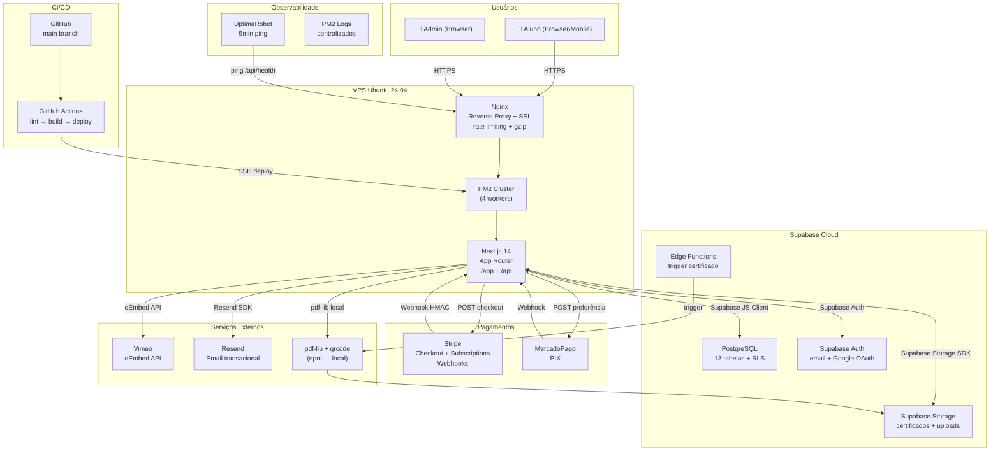

# 2. Arquitetura de Alto Nível

## 2.1 Resumo Técnico

A plataforma é uma aplicação **fullstack monolítica** construída com Next.js 14 App Router, onde o frontend e as API routes coexistem no mesmo processo Node.js. O backend de dados é completamente delegado ao Supabase (PostgreSQL + Auth + Storage + RLS), eliminando a necessidade de um servidor de API separado. O controle de acesso é feito em nível de banco via Row Level Security — o código de aplicação nunca verifica permissões manualmente. Pagamentos são processados via Stripe (cartão/assinatura) e MercadoPago (PIX), com webhooks que atualizam o banco automaticamente. O deploy é feito em VPS Ubuntu 24.04 com PM2 em cluster mode e Nginx como reverse proxy, garantindo custo fixo, controle total dos dados (LGPD) e sem cold starts.

## 2.2 Plataforma e Infraestrutura

**Decisão: VPS Própria (Hostinger/Hetzner/Vultr)**

| Opção                           | Prós                                                           | Contras                                                               | Decisão            |
| ------------------------------- | -------------------------------------------------------------- | --------------------------------------------------------------------- | ------------------ |
| VPS Própria (Hetzner/Hostinger) | Custo fixo R$80-150/mês, controle total, sem cold starts, LGPD | Responsabilidade operacional, requer DevOps                           | ✅ **ESCOLHIDA**   |
| Vercel + Supabase               | Deploy trivial, edge network global, zero-ops                  | Custo variável com tráfego, cold starts em serverless, vendor lock-in | Plano B emergência |
| Railway                         | Simples, self-service                                          | Menos controle, custo pode escalar                                    | Descartada         |

**Plataforma:** VPS Ubuntu 24.04 LTS
**Serviços principais:** Node.js 22 + PM2 (cluster) + Nginx + Let's Encrypt + UFW + Fail2ban
**Supabase:** Cloud (free tier → Pro quando necessário) para DB/Auth/Storage
**Domínio de produção:** `ead.fabioborgesoficial.com.br`

## 2.3 Estrutura do Repositório

**Monorepo leve** — aplicação Next.js única com todas as concerns no mesmo repositório. Sem Turborepo ou Nx (overhead desnecessário para equipe pequena).

```
Estrutura: Monorepo single-app (Next.js App Router)
Ferramenta: npm workspaces (nativo)
Organização: /src com feature folders
```

## 2.4 Diagrama de Arquitetura



## 2.5 Padrões Arquiteturais

- **Next.js App Router (Jamstack híbrido):** Server Components para dados públicos (SSR/SSG), Client Components apenas onde há interatividade — _Rationale:_ performance máxima + SEO para páginas de cursos
- **BFF implícito (Backend for Frontend):** API routes do Next.js servem como camada de orquestração entre o cliente e os serviços externos (Stripe, Supabase, Resend) — _Rationale:_ sem expor secrets ao cliente
- **RLS-First Authorization:** Toda autorização de dados ocorre via Postgres Row Level Security, não em código — _Rationale:_ autorização centralizada, impossível de bypassar, mais segura
- **Webhook-driven state transitions:** Mudanças de estado de pagamento e assinatura são disparadas por webhooks verificados (HMAC), não por polling — _Rationale:_ consistência eventual garantida com idempotência
- **Component-based UI (Atomic Design):** Átomos → Moléculas → Organismos conforme `docs/front-end-spec.md` — _Rationale:_ reusabilidade e manutenção
- **Server Actions para mutações simples:** Formulários de perfil, progresso de aula via Server Actions do Next.js 14 — _Rationale:_ reduz boilerplate de API routes para mutações simples

---
