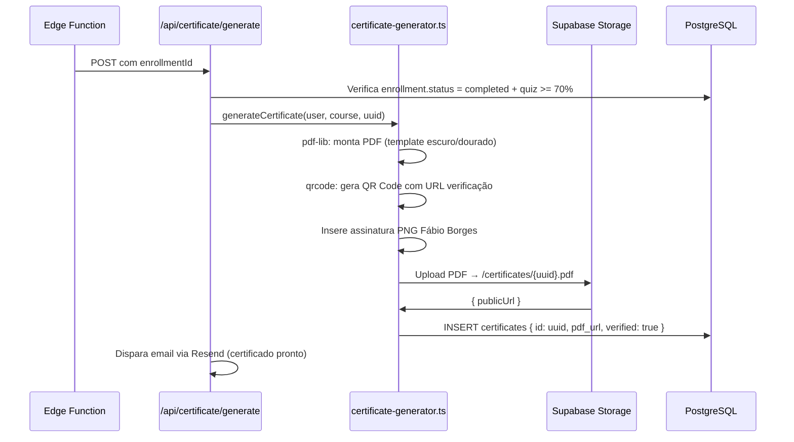
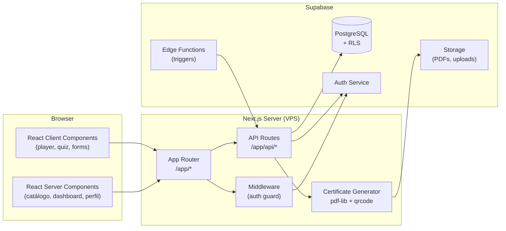

# 6. Componentes do Sistema

## 6.1 Next.js App (Frontend + BFF)

**Responsabilidade:** Interface do usuário + orquestração de serviços externos
**Interfaces principais:**

- Renderização de páginas (SSR/SSG/CSR conforme rota)
- API routes como BFF para Stripe, Supabase, Resend
- Server Components para dados sem interatividade
- Client Components para player, quiz, upload

**Dependências:** Supabase JS, Stripe SDK, MercadoPago SDK, Resend SDK, pdf-lib

---

## 6.2 Supabase (Data Layer)

**Responsabilidade:** Banco de dados, autenticação, storage
**Interfaces:**

- `@supabase/supabase-js` client (browser + server)
- `@supabase/ssr` para cookies no App Router
- RLS policies como camada de autorização
- Edge Functions para triggers assíncronos (certificados)

**Instâncias:**

- `createBrowserClient()` → componentes client-side
- `createServerClient()` → Server Components e API routes (usa cookies)

---

## 6.3 Stripe (Pagamentos)

**Responsabilidade:** Checkout, assinaturas recorrentes, webhooks
**Interfaces:**

- `stripe.checkout.sessions.create()` → redirect para Stripe
- `stripe.webhooks.constructEvent()` → verificação HMAC obrigatória
- `stripe.subscriptions.*` → gestão de assinaturas

---

## 6.4 Gerador de Certificados (Local)

**Responsabilidade:** Gerar PDF + QR Code de forma assíncrona
**Localização:** `src/lib/certificate-generator.ts`
**Dependências:** `pdf-lib`, `qrcode`, Supabase Storage
**Trigger:** Edge Function Supabase ou POST /api/certificate/generate

---

## 6.5 Diagrama de Componentes

---
