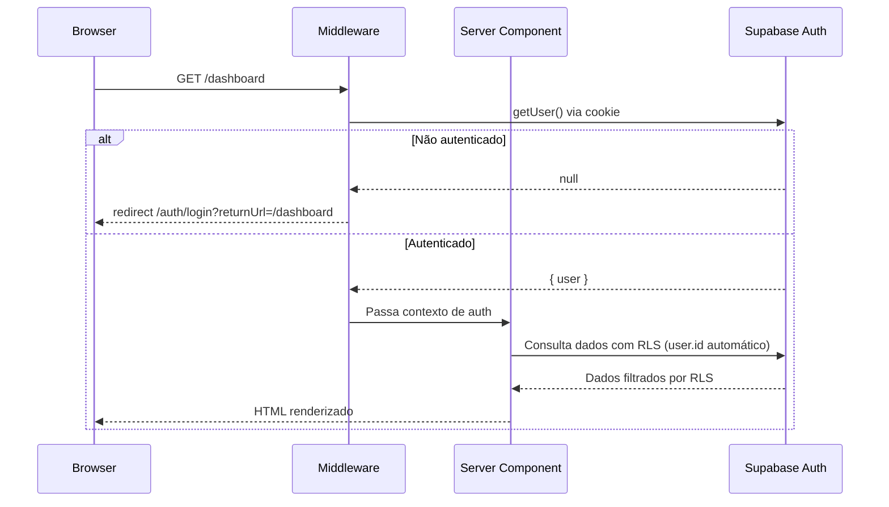
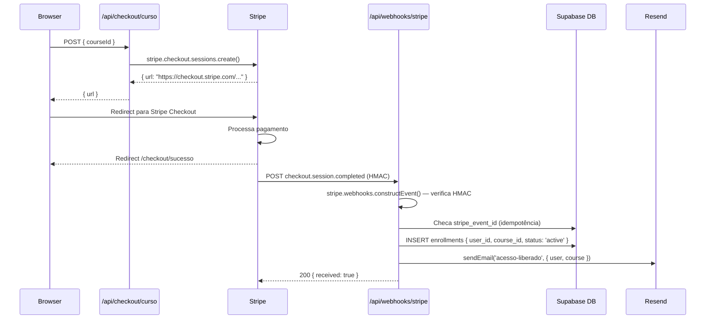

# 8. Workflows do Sistema — Sequências

## 8.1 Fluxo de Autenticação (SSR)

```mermaid
sequenceDiagram
    participant B as Browser
    participant MW as Middleware
    participant SC as Server Component
    participant SB as Supabase Auth

    B->>MW: GET /dashboard
    MW->>SB: getUser() via cookie
    alt Não autenticado
        SB-->>MW: null
        MW-->>B: redirect /auth/login?returnUrl=/dashboard
    else Autenticado
        SB-->>MW: { user }
        MW->>SC: Passa contexto de auth
        SC->>SB: Consulta dados com RLS (user.id automático)
        SB-->>SC: Dados filtrados por RLS
        SC-->>B: HTML renderizado
    end
```

## 8.2 Fluxo de Compra e Liberação de Acesso

```mermaid
sequenceDiagram
    participant B as Browser
    participant API as /api/checkout/curso
    participant ST as Stripe
    participant WH as /api/webhooks/stripe
    participant SB as Supabase DB
    participant RS as Resend

    B->>API: POST { courseId }
    API->>ST: stripe.checkout.sessions.create()
    ST-->>API: { url: "https://checkout.stripe.com/..." }
    API-->>B: { url }
    B->>ST: Redirect para Stripe Checkout
    ST->>ST: Processa pagamento
    ST-->>B: Redirect /checkout/sucesso
    ST->>WH: POST checkout.session.completed (HMAC)
    WH->>WH: stripe.webhooks.constructEvent() — verifica HMAC
    WH->>SB: Checa stripe_event_id (idempotência)
    WH->>SB: INSERT enrollments { user_id, course_id, status: 'active' }
    WH->>RS: sendEmail('acesso-liberado', { user, course })
    WH-->>ST: 200 { received: true }
```

---
